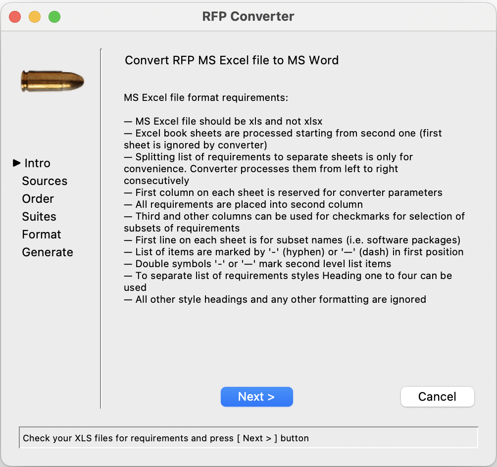

# ExToWord — Excel To Word Converter

Script convert MS Excel files to MS Word according to certain rules.
The rules are displayed on first wizard screen.
Script is developed to support macOS, Windows, and Linux (not tested).

## Get Sources
Following instructions are for Linux/macOS.

To run please install python3 (https://www.python.org/downloads/) and tkinter.
The latest can be installed using following command (for macOS):
```commandline
brew install python-tk
```
or (for Ubuntu flavored Linux):
```commandline
apt-get install python-tk 
```
Then clone this repository and install required packages:
```commandline
git clone https://github.com/mpkondrashin/extoword.git
cd extoword
python3 -m venv venv
source venv/bin/activate
pip install -r requirements.txt
```

## Run Script

Use following command to run script:
```commandline
python gui.py
```

## Build Self-contained Executable

Run following command
```commandline
python build.py
```
This will generate ```extoword``` executable that does not require to have python
to be installed.

Note: This feature was tested only for macOS

## GUI image



## Bugs

This script was not tested under Linux
